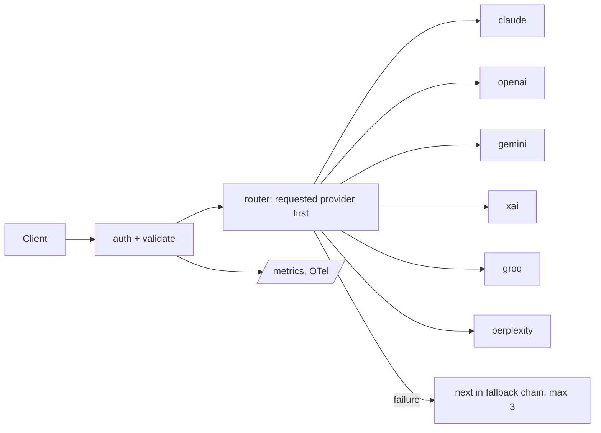

# AI Gateway v3.0.0

Multi-provider AI Gateway — a unified, secure, and high-performance middleware for all Bogdan projects. 

This service acts as a single point of entry for multiple AI providers, handling authentication, validation, and standardized request/response formats.

**Live:** `curl https://ai-gateway-382299704849.europe-west2.run.app/health` →
`{"status":"healthy","service":"ai-gateway","version":"3.0.0","providers":["openai","claude","gemini","xai","groq","perplexity"]}`
(Cloud Run, europe-west2, min-instances 0; authenticated routes return 401 without a key.)

## Features
- OpenAI-compatible `/v1/chat/completions` and `/v1/embeddings`, SSE streaming
- Bounded cross-provider fallback chain (`src/providers/index.ts`)
- Per-tenant policies and monthly spend caps (`src/lib/tenant-policy.ts`, `src/lib/spend-tracking.ts`)
- Request dedup cache, concurrency limiter, Prometheus `/metrics`, OpenTelemetry → Cloud Trace
- Zod request validation and a versioned response contract enforced at runtime (`src/middleware/contract.ts`)



Tests: `npm test` — 89 passing at this revision. Consumers: PrimărIA (`src/lib/ai/config.ts` there). EuFund migrated to direct SDK routing in May 2026.

## 🛠️ Supported Providers

- **OpenAI**
- **Anthropic**
- **Google**
- **xAI**
- **Groq**
- **Perplexity**

Model ids are configured per provider adapter (see `src/providers/*.ts`); requests may name any id the upstream provider accepts.

## 🔧 Environment Variables

The gateway requires the following environment variables to function:

| Variable | Description |
|----------|-------------|
| `PORT` | Server port (default: 8080) |
| `LOG_LEVEL` | Pino log level (default: `info`) |
| `GATEWAY_MASTER_KEY` | Bearer token required for all authenticated routes |
| `CORS_ORIGINS` | Comma-separated allowed origins |
| `REQUIRE_TENANT_ID` | When `true`, requests must provide `x-tenant-id` or `tenant_id` |
| `TENANT_POLICIES_JSON` | JSON object keyed by tenant id with `allowedProviders`, `allowedModels`, `maxTokens`, and `maxConcurrentRequests` |
| `MAX_CONCURRENT_REQUESTS` | Global in-flight completion cap per instance (default: `50`) |
| `MAX_FALLBACK_ATTEMPTS` | Maximum providers to try for a single completion when fallback is enabled (default: `3`) |
| `OPENAI_API_KEY` | (Optional) Enables OpenAI provider |
| `ANTHROPIC_API_KEY` | (Optional) Enables Claude provider |
| `GOOGLE_API_KEY` | (Optional) Enables Gemini provider |
| `XAI_API_KEY` | (Optional) Enables xAI Grok provider |
| `GROQ_API_KEY` | (Optional) Enables Groq provider |
| `PERPLEXITY_API_KEY` | (Optional) Enables Perplexity provider |
| `OTEL_ENABLED` | Set to `true` to enable OpenTelemetry tracing export |
| `OTEL_SERVICE_NAME` | Override trace service name (default: `ai-gateway`) |
| `OTEL_SERVICE_VERSION` | Override trace service version (defaults to package version) |

## 📦 Getting Started

### Local Development

```bash
# Install dependencies
npm install

# Run in development mode
npm run dev
```

### Build & Production

```bash
# Build TypeScript
npm run build

# Start production server
npm start
```

## 🐳 Docker

The project includes a multi-stage `Dockerfile` optimized for Cloud Run.

```bash
docker build -t ai-gateway .
docker run -p 8080:8080 --env-file .env ai-gateway
```

The container `HEALTHCHECK` targets `GET /health` for cheap liveness. Use authenticated `GET /ready` for deployment readiness and provider diagnostics.

## 📡 API Endpoints

- `GET /health`: Service status and enabled providers.
- `GET /ready`: Public config-level readiness; authenticated callers also get live provider reachability and in-flight counts.
- `GET /providers`: Detailed list of available models and configurations.
- `POST /v1/chat/completions`: OpenAI-compatible chat completion.
- `POST /complete`: Simplified completion endpoint.

## 🔍 Operational Notes

- `/health` is a cheap liveness endpoint. Public `/ready` is intentionally cheap and non-probing. Deployment and traffic-gating checks must call authenticated `/ready`.
- Production deployment must target the canonical Cloud Run service URL from `gcloud run services describe ai-gateway --project mitch-ai-services --region europe-west2 --format='value(status.url)'` rather than assuming a regional alias.
- Error responses now include stable `error.code` values such as `routing.unsupported_provider`, `tenant.required`, and `concurrency.global_limit_reached` for alerting and log queries.
- Provider fallback is capped to `MAX_FALLBACK_ATTEMPTS` and skips retries for non-retryable provider 4xx failures.
- Tenant policy can be rolled out gradually by setting `TENANT_POLICIES_JSON` first, then enabling `REQUIRE_TENANT_ID=true` once clients are sending tenant identity consistently.
- A deployment-ready environment template is available at [`docs/cloud-run.env.example`](docs/cloud-run.env.example).
- A production rollout checklist with suggested starting values is available at [`docs/cloud-run-rollout.md`](docs/cloud-run-rollout.md).
- A Cloud Monitoring alert setup guide (with automation script) is available at [`docs/cloud-monitoring-alerts.md`](docs/cloud-monitoring-alerts.md).
- A rate-limit validation load-test guide is available at [`docs/rate-limit-load-test.md`](docs/rate-limit-load-test.md).
- A shared consumer compatibility matrix is available at [`docs/COMPATIBILITY.md`](docs/COMPATIBILITY.md).
- A release gating checklist is available at [`docs/RELEASE-PROCESS.md`](docs/RELEASE-PROCESS.md).
- A shared live validation guide for Taxes and EU-Funds is available at [`docs/consumer-validation.md`](docs/consumer-validation.md).
- Contract schemas for the current response surface live in [`src/contracts/v1.contract.ts`](src/contracts/v1.contract.ts).

---
*Maintained by Bogdan — Part of the Mitch From Transylvania ecosystem.*
